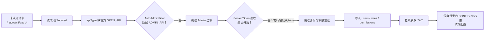

# nacos3-scopehole

**Nacos 3.x 鉴权作用域错配漏洞的检测、复现与批量验证工具**


`QVD-2026-59388` · 单文件静态二进制 · 零写入检测 · 完整利用链 · 并发批量验证

> [!CAUTION]
> 本项目仅用于已获得明确授权的安全测试、企业自查和隔离环境研究。默认模式会临时创建账户、角色、权限和配置；虽然工具会尽力自动清理，但仍应先做好快照和回滚准备。生产环境请优先使用 `--check-only`。

## 项目概览

| 项目 | 说明 |
|---|---|
| 漏洞编号 | `QVD-2026-59388` |
| 影响版本 | Nacos `3.0.0` 至 `3.2.3` |
| 修复版本 | Nacos `3.2.4` |
| 触发条件 | 8848 HTTP 服务对测试端可达，且 `nacos.core.auth.enabled=false` |
| 根本原因 | 管理 Handler 未标记 `ApiType.ADMIN_API`，被默认归入关闭鉴权的 `OPEN_API` 作用域 |
| 已验证环境 | 官方 Docker 镜像 `nacos/nacos-server:v3.2.3` 与 `v3.2.4`，2026-08 |
| 已验证影响 | 未认证创建账户、绑定普通角色、授予数据面权限，随后通过正常 RBAC 读写配置 |

实测新账户的登录响应为 `globalAdmin=false`。因此，本项目验证的是**管理员级数据面权限**，不是把账户提升为 Nacos 保留角色 `ROLE_ADMIN`。

## 目录

- [快速开始](#快速开始)
- [工作模式](#工作模式)
- [漏洞原理](#漏洞原理)
- [详细代码分析](#详细代码分析)
- [命令行参考](#命令行参考)
- [隔离复现环境](#隔离复现环境)
- [实测结果](#实测结果)
- [修复与排查](#修复与排查)
- [项目结构](#项目结构)
- [安全与合规](#安全与合规)
- [参考资料](#参考资料)

## 快速开始

### 1. 构建与测试

要求 Go `1.27` 或更高版本。

```bash
go test ./...
go build -o nacos3-scopehole .
```

Linux AMD64 交叉编译示例：

```bash
GOOS=linux GOARCH=amd64 go build -o nacos3-scopehole .
```

### 2. 先执行零写入检测

```bash
go run . --base-url http://127.0.0.1:8848/nacos --check-only
```

该模式只发送 GET 请求，不创建、修改或删除目标数据。若检测结果为 `vulnerable`，再在授权的隔离环境中执行完整链。

### 3. 在隔离环境验证完整链

```bash
go run . --base-url http://127.0.0.1:8848/nacos
```

默认流程会创建带 128 位随机后缀的测试账户、角色、`*:* / rw` 权限及一条标记配置。写入前只有收到 Nacos 的 `20004 / resource not found` 才确认配置不存在，写入后会精确比对内容；清理前还会再次核对内容归属，若内容被其他写入修改则拒绝删除。网络中断或服务异常时仍需人工复核残留数据。

## 工作模式

| 模式 | 命令 | 是否写入 | 适用场景 |
|---|---|---:|---|
| 完整链 | `nacos3-scopehole` | 是 | 隔离环境中的漏洞复现与修复对照 |
| 零写入检测 | `--check-only` | 否 | 单目标快速确认、生产环境低扰动自查 |
| 批量检测 | `--batch FILE [--workers N]` | 否 | 对授权资产清单进行并发验证 |

完整链的执行顺序为：

1. 用 Admin API 的未认证响应作为对照组，确认 Admin 作用域正在鉴权。
2. 未认证创建账户、绑定角色并授予 `*:* / rw` 权限。
3. 使用新账户登录并获取 JWT。
4. 携带 JWT 读取 Admin 作用域的配置接口。
5. 对随机标记配置执行不存在检查，确认不会覆盖已有数据。
6. 写入并精确回读标记内容，证明 CONFIG 写权限确实生效。
7. 清理前重新验证标记内容归属，再删除标记配置、权限、角色和账户。

批量模式会把每个目标归类为：

| 状态 | 含义 |
|---|---|
| `vulnerable` | Admin 对照组返回 403，但未认证用户列表返回成功，符合本漏洞特征 |
| `open-auth` | Admin 作用域也可未认证访问，目标存在更宽泛的鉴权关闭问题，不能单独归因于本漏洞 |
| `protected` | 用户列表返回可识别的 Nacos 鉴权拒绝；只说明当前接口受保护，不推断具体版本 |
| `unreachable` | 网络连接或请求失败 |
| `inconclusive` | 目标可达，但响应不足以确定状态 |
| `invalid` | 目标 URL 无效 |

## 漏洞原理

Nacos 3.x 通过 `@Secured(apiType = ...)` 把接口分配到不同的鉴权作用域，各作用域使用独立开关：

| API 类型 | 过滤器 | 配置项 | 发行包默认值 |
|---|---|---|---:|
| `ADMIN_API` | `AuthAdminFilter` | `nacos.core.auth.admin.enabled` | `true` |
| `CONSOLE_API` | `NacosConsoleAuthFilter` | `nacos.core.auth.console.enabled` | `true` |
| `OPEN_API` | `AuthFilter` | `nacos.core.auth.enabled` | `false` |

`@Secured` 的 `apiType` 默认值是 `OPEN_API`。3.2.3 的用户、角色和权限管理 Handler 虽然声明了 `@Secured`，却没有显式设置 `apiType`，于是发生了两次连续放行：

1. `AuthAdminFilter` 发现接口不是 `ADMIN_API`，直接跳过。
2. `AuthFilter` 虽然匹配该接口，但 Server/Open 作用域默认未开启，又直接跳过。

身份解析、身份验证和权限验证都位于这两个早退分支之后，因此未认证请求最终进入 Controller。



3.2.4 的核心修复是把受影响 Handler 显式归入 Admin 作用域：

```diff
 @Secured(resource = AuthConstants.CONSOLE_RESOURCE_NAME_PREFIX + "users",
-    action = ActionTypes.WRITE)
+    action = ActionTypes.WRITE, apiType = ApiType.ADMIN_API)
```

## 详细代码分析

以下分析固定到 Nacos `3.2.3` 提交 [`c843da5bee635e2e4c14abf0386057eb1128db47`](https://github.com/alibaba/nacos/tree/c843da5bee635e2e4c14abf0386057eb1128db47)，修复对照固定到 `3.2.4` 提交 [`2c587c04891d532df1544ae95b906b677ac8eeff`](https://github.com/alibaba/nacos/tree/2c587c04891d532df1544ae95b906b677ac8eeff)。所有源码链接均指向不可变提交，便于复核。

### 1. `apiType` 决定鉴权路由

Nacos 将接口划分为 `ADMIN_API`、`CONSOLE_API`、`OPEN_API`、`INNER_API` 四类（[`ApiType.java:25-42`](https://github.com/alibaba/nacos/blob/c843da5bee635e2e4c14abf0386057eb1128db47/api/src/main/java/com/alibaba/nacos/api/common/ApiType.java#L25-L42)）。`@Secured` 中的默认值明确写为 `ApiType.OPEN_API`（[`Secured.java:75-80`](https://github.com/alibaba/nacos/blob/c843da5bee635e2e4c14abf0386057eb1128db47/auth/src/main/java/com/alibaba/nacos/auth/annotation/Secured.java#L75-L80)）：

```java
ApiType apiType() default ApiType.OPEN_API;
```

`AuthConfig` 使用不同作用域的配置分别构造 `AuthFilter` 和 `AuthAdminFilter`（[`AuthConfig.java:56-68`](https://github.com/alibaba/nacos/blob/c843da5bee635e2e4c14abf0386057eb1128db47/core/src/main/java/com/alibaba/nacos/core/auth/AuthConfig.java#L56-L68)），所以 `apiType` 不是说明性标签，而是决定请求由哪套鉴权开关处理的路由键。

发行包的有效默认配置为（[`distribution/conf/application.properties:272-282`](https://github.com/alibaba/nacos/blob/c843da5bee635e2e4c14abf0386057eb1128db47/distribution/conf/application.properties#L272-L282)）：

```properties
nacos.core.auth.enabled=false
nacos.core.auth.admin.enabled=true
nacos.core.auth.console.enabled=true
```

问题不在于三个开关全部关闭，而在于管理 Handler 被错误路由到唯一默认关闭的鉴权作用域。

### 2. 过滤器的两个早退分支

`AbstractWebAuthFilter` 先根据 Controller 方法的 `@Secured` 判断当前过滤器是否匹配，再判断该作用域是否开启（[`AbstractWebAuthFilter.java:70-96`](https://github.com/alibaba/nacos/blob/c843da5bee635e2e4c14abf0386057eb1128db47/core/src/main/java/com/alibaba/nacos/core/auth/AbstractWebAuthFilter.java#L70-L96)）：

```java
if (!isMatchFilter(secured)) {
    chain.doFilter(request, response);
    return;
}
if (!isAuthEnabled()) {
    chain.doFilter(request, response);
    return;
}
```

- `AuthAdminFilter` 只匹配 `ApiType.ADMIN_API`（[`AuthAdminFilter.java:39-48`](https://github.com/alibaba/nacos/blob/c843da5bee635e2e4c14abf0386057eb1128db47/core/src/main/java/com/alibaba/nacos/core/auth/AuthAdminFilter.java#L39-L48)）。被错分为 `OPEN_API` 的 `/v3/auth/*` 在第一个分支跳过，`admin.enabled=true` 没有机会生效。
- `AuthFilter` 匹配所有非 `ADMIN_API` 方法（[`AuthFilter.java:45-54`](https://github.com/alibaba/nacos/blob/c843da5bee635e2e4c14abf0386057eb1128db47/core/src/main/java/com/alibaba/nacos/core/auth/AuthFilter.java#L45-L54)），但它读取 Server/Open 作用域配置；当 `nacos.core.auth.enabled=false` 时，请求在第二个分支再次跳过。
- `validateIdentity()` 和 `validateAuthority()` 位于早退之后（[`AbstractWebAuthFilter.java:101-142`](https://github.com/alibaba/nacos/blob/c843da5bee635e2e4c14abf0386057eb1128db47/core/src/main/java/com/alibaba/nacos/core/auth/AbstractWebAuthFilter.java#L101-L142)），所以漏洞请求不会执行身份与权限校验。

### 3. 从 HTTP 入口到持久化调用

三个 Controller 的类级路径分别是 `/v3/auth/user`、`/v3/auth/role` 和 `/v3/auth/permission`。受影响方法都带有 `@Secured`，但均缺少 `apiType`：

| 未认证入口 | 3.2.3 代码位置 | 持久化调用 | 直接结果 |
|---|---|---|---|
| `POST /nacos/v3/auth/user` | [`UserControllerV3.java:109-118`](https://github.com/alibaba/nacos/blob/c843da5bee635e2e4c14abf0386057eb1128db47/plugin-default-impl/nacos-default-auth-plugin/src/main/java/com/alibaba/nacos/plugin/auth/impl/controller/v3/UserControllerV3.java#L109-L118) | `userDetailsService.createUser(...)` | 创建可登录账户 |
| `POST /nacos/v3/auth/role` | [`RoleControllerV3.java:64-70`](https://github.com/alibaba/nacos/blob/c843da5bee635e2e4c14abf0386057eb1128db47/plugin-default-impl/nacos-default-auth-plugin/src/main/java/com/alibaba/nacos/plugin/auth/impl/controller/v3/RoleControllerV3.java#L64-L70) | `roleService.addRole(...)` | 创建角色并绑定账户 |
| `POST /nacos/v3/auth/permission` | [`PermissionControllerV3.java:68-75`](https://github.com/alibaba/nacos/blob/c843da5bee635e2e4c14abf0386057eb1128db47/plugin-default-impl/nacos-default-auth-plugin/src/main/java/com/alibaba/nacos/plugin/auth/impl/controller/v3/PermissionControllerV3.java#L68-L75) | `nacosRoleService.addPermission(...)` | 写入攻击者指定的资源与动作 |
| `GET /nacos/v3/auth/user/list` | [`UserControllerV3.java:259-271`](https://github.com/alibaba/nacos/blob/c843da5bee635e2e4c14abf0386057eb1128db47/plugin-default-impl/nacos-default-auth-plugin/src/main/java/com/alibaba/nacos/plugin/auth/impl/controller/v3/UserControllerV3.java#L259-L271) | `userDetailsService.getUsers(...)` | 无写入判断管理面是否被错分 |

`createUser` 并非孤立问题。单独创建一个无角色账户的影响有限；角色和权限接口同时错分，才组成完整的权限提升链。

### 4. `*:* / rw` 如何获得配置读写权限

本工具为随机普通角色授予资源 `*:*`、动作 `rw`。Nacos 权限检查会把资源中的 `*` 替换为正则 `.*`，再通过 `Pattern.matches()` 与实际 CONFIG 资源进行整串匹配；动作字符串只需包含目标动作即可（[`AbstractCheckedRoleService.java:77-95`](https://github.com/alibaba/nacos/blob/c843da5bee635e2e4c14abf0386057eb1128db47/plugin-default-impl/nacos-default-auth-plugin/src/main/java/com/alibaba/nacos/plugin/auth/impl/roles/AbstractCheckedRoleService.java#L77-L95)）。因此：

- `*:*` 可匹配配置资源标识。
- `rw` 同时满足读、写动作检查。

登录拿到 JWT 后，对 `/v3/admin/cs/config` 的请求会正常经过 Admin 鉴权。配置发布 Handler 要求 `ADMIN_API` 与 CONFIG `WRITE`，最终调用 `configOperationService.publishConfig(...)`（[`ConfigControllerV3.java:196-244`](https://github.com/alibaba/nacos/blob/c843da5bee635e2e4c14abf0386057eb1128db47/config/src/main/java/com/alibaba/nacos/config/server/controller/v3/ConfigControllerV3.java#L196-L244)）。

这意味着攻击链后半段没有再次绕过 Admin 过滤器，而是使用前半段未授权写入的身份与权限数据，通过正常 RBAC 完成配置读写。

### 5. 管理员级权限不等于 `ROLE_ADMIN`

Nacos 会拒绝通过普通 `addRole()` 创建系统保留的 `ROLE_ADMIN`（[`NacosRoleServiceDirectImpl.java:125-145`](https://github.com/alibaba/nacos/blob/c843da5bee635e2e4c14abf0386057eb1128db47/plugin-default-impl/nacos-default-auth-plugin/src/main/java/com/alibaba/nacos/plugin/auth/impl/roles/NacosRoleServiceDirectImpl.java#L125-L145)）。权限检查还规定，普通角色遇到 `console/*` 资源时直接返回 `false`，只有真正的 `ROLE_ADMIN` 才能全局放行（[`AbstractCheckedRoleService.java:53-75`](https://github.com/alibaba/nacos/blob/c843da5bee635e2e4c14abf0386057eb1128db47/plugin-default-impl/nacos-default-auth-plugin/src/main/java/com/alibaba/nacos/plugin/auth/impl/roles/AbstractCheckedRoleService.java#L53-L75)）。

因此，证据支持的结论边界是：

- 已证实：未认证创建账户、绑定普通角色、授予任意数据资源权限，并据此读写 Nacos 配置。
- 账户属性：登录响应为 `globalAdmin=false`。
- 权限边界：该链未把账户变成保留的 `ROLE_ADMIN`，也没有证明它能访问所有 `console/*` 管理资源。

“管理员级”描述的是对配置数据面的广泛控制能力，而不是账户内部的全局管理员标志。

### 6. 3.2.4 如何关闭攻击路径

3.2.4 在用户、角色和权限 Controller 的相关增删查改方法上统一增加 `apiType = ApiType.ADMIN_API`：

- [`UserControllerV3.java:111-115`](https://github.com/alibaba/nacos/blob/2c587c04891d532df1544ae95b906b677ac8eeff/plugin-default-impl/nacos-default-auth-plugin/src/main/java/com/alibaba/nacos/plugin/auth/impl/controller/v3/UserControllerV3.java#L111-L115)
- [`RoleControllerV3.java:65-71`](https://github.com/alibaba/nacos/blob/2c587c04891d532df1544ae95b906b677ac8eeff/plugin-default-impl/nacos-default-auth-plugin/src/main/java/com/alibaba/nacos/plugin/auth/impl/controller/v3/RoleControllerV3.java#L65-L71)
- [`PermissionControllerV3.java:69-76`](https://github.com/alibaba/nacos/blob/2c587c04891d532df1544ae95b906b677ac8eeff/plugin-default-impl/nacos-default-auth-plugin/src/main/java/com/alibaba/nacos/plugin/auth/impl/controller/v3/PermissionControllerV3.java#L69-L76)

修复后，请求命中已开启的 Admin 作用域，未认证访问会在 Controller 之前返回 403，用户、角色和权限三个持久化调用均不可达。三类接口必须同时修复，否则已有低权限账户仍可能借助残留的角色或权限接口继续提升。

### 7. 利用条件与严重度边界

| 维度 | 结论 |
|---|---|
| 版本条件 | `3.0.0 <= version <= 3.2.3` |
| 配置条件 | `nacos.core.auth.enabled=false`；发行包默认满足，显式设置为 `true` 会阻断本链 |
| 网络条件 | 8848 HTTP 服务必须对攻击者可达；仅内网可达时属于内网攻击面 |
| 边界跨越 | 从无 Nacos 身份变为持有 JWT 且拥有 CONFIG `rw` 权限的账户 |
| 直接影响 | 用户、角色、权限记录可被篡改，配置机密性与完整性受损 |
| 后续影响 | 配置若包含数据库口令、API 密钥等凭据，影响可能扩展到下游系统，但需结合部署单独验证 |

公网或广泛内网可达、且配置承载关键凭据时，实际风险可达到高危。回环监听、网关来源限制或开启 Server/Open API 鉴权会显著降低可利用性。漏洞通告评分不能替代对具体暴露面的判断，也不应在缺乏证据时把影响直接等同于 RCE。

## 命令行参考

### 常用命令

```bash
# 默认目标：http://127.0.0.1:8848/nacos
go run .

# 指定单个目标
go run . --base-url http://10.0.0.5:8848/nacos

# 零写入检测
go run . --base-url http://10.0.0.5:8848/nacos --check-only

# 并发批量检测
go run . --batch targets.txt --workers 8

# 保留测试账户、角色、权限、标记配置和 token
go run . --no-cleanup
```

> [!WARNING]
> `--no-cleanup` 会故意保留可用账户、权限和测试配置，只能在隔离实验环境中使用。运行结束后应人工删除全部测试数据。

### 参数

| 参数 | 默认值 | 说明 |
|---|---|---|
| `--base-url` | `http://127.0.0.1:8848/nacos` | Nacos API Context 根地址，必须是绝对 HTTP(S) URL |
| `--console-url` | 同 `--base-url` | 控制台根地址；控制台独立端口部署时用于登录，例如 `http://host:8080/nacos` |
| `--check-only` | `false` | 只执行零写入检测，不发送 POST 或 DELETE 请求 |
| `--no-cleanup` | `false` | 保留完整链创建的账户、角色、权限、标记配置和 token |
| `--batch FILE` | — | 从文件读取目标并执行零写入批量检测 |
| `--workers N` | `8` | 批量并发数，必须大于等于 1 |

### 批量目标文件

每行一个目标；空行和以 `#` 开头的注释会被忽略。裸 `host:port` 会自动补全 `http://` 和 `/nacos`，无效 URL 会标记为 `invalid`，不会中断整个任务。

```text
# targets.txt
10.0.0.5:8848
http://10.0.0.6:8848/nacos
```

### 退出码

| 退出码 | 单目标 | 批量模式 |
|---:|---|---|
| `0` | 完整或零写入验证成功 | 至少存在一个 `vulnerable` 或 `open-auth` |
| `1` | 未复现、被拒绝或已修复 | 未发现 `vulnerable / open-auth` |
| `2` | 链路部分成功、清理未完成，或参数、目标文件错误 | 参数或输入错误 |
| `3` | 网络错误或目标不可达 | — |

### 运行行为

- 单次 HTTP 请求超时为 8 秒。
- 单个响应体上限为 1 MiB，同时覆盖 Content-Length 和流式响应。
- 仅允许同源重定向；协议、主机或有效端口发生变化时立即终止，避免凭据或测试范围外泄。
- 内置 HTTP 客户端不读取 `HTTP_PROXY`、`HTTPS_PROXY` 等环境代理变量，认证表单和 `accessToken` 只发送到命令行明确指定的目标。
- 请求头使用常规控制台访问格式，包括 `User-Agent` 和 `Accept: application/json`。
- 完整链每次使用加密安全随机源预先生成账户、角色、密码、全部候选标记配置名称和内容；随机源失败时会在任何网络写入前终止。
- 服务端响应中的终端控制字符会转为可见转义形式；token 只按转义后的值显示，不拼接为可复制执行的 Shell 命令。
- Nacos 鉴权缓存通常约 15 秒刷新；登录和权限生效分别提供最长 45 秒的重试窗口，每 5 秒重试一次。
- 完整链默认自动清理；任何清理失败都会输出 `cleanup warning` 并把原成功退出码提升为 `2`。
- 批量结果按目标文件顺序输出合法目标，无效 URL 统一放在末尾。

> [!NOTE]
> Nacos 配置 API 不提供“仅当内容仍等于某值时删除”的条件删除能力。工具会使用 128 位随机名称，并在写入前检查不存在、写入后核对内容、删除前再次核对所有权；但检查与写入/删除仍是两个 HTTP 请求，无法从客户端消除并发写入的竞态。若发现内容变化，工具会拒绝删除并返回退出码 `2`。

## 隔离复现环境

以下命令同时启动 3.2.3 漏洞实例和 3.2.4 修复对照。端口按原始映射暴露：漏洞实例使用 `8848`，修复实例使用 `18848`。

```bash
docker run -d --name nacos-vuln -p 8848:8848 -e MODE=standalone -e NACOS_AUTH_TOKEN=SecretKey012345678901234567890123456789012345678901234567890123456789 -e NACOS_AUTH_IDENTITY_KEY=serverIdentity -e NACOS_AUTH_IDENTITY_VALUE=security nacos/nacos-server:v3.2.3

docker run -d --name nacos-patched -p 18848:8848 -e MODE=standalone -e NACOS_AUTH_TOKEN=SecretKey012345678901234567890123456789012345678901234567890123456789 -e NACOS_AUTH_IDENTITY_KEY=serverIdentity -e NACOS_AUTH_IDENTITY_VALUE=security nacos/nacos-server:v3.2.4
```

> [!IMPORTANT]
> Docker 的 `-p 8848:8848` 通常会把端口发布到主机所有网络接口。请确保 Docker Desktop、主机防火墙和实验网络已经隔离，避免让漏洞实例暴露到不受控网络。

等待服务启动后执行对照验证：

```bash
# 3.2.3：期望 REPRODUCED
go run . --base-url http://127.0.0.1:8848/nacos

# 3.2.4：期望 NOT REPRODUCED / protected
go run . --base-url http://127.0.0.1:18848/nacos
```

该环境保持发行包默认的作用域组合：`auth.enabled=false`、`admin.enabled=true`。它不代表所有 API 都已开启鉴权。工具会先通过 Admin 对照请求确认 Admin 作用域确实在工作，再验证被错分到 Server/Open 作用域的管理接口。

实验完成后可删除测试容器：

```bash
docker rm -f nacos-vuln nacos-patched
```

## 实测结果

### 完整链：3.2.3

以下输出已做截断，保留关键判定点：

```text
Target: http://127.0.0.1:8848/nacos
Console: http://127.0.0.1:8848/nacos
Ephemeral test identity: deploysync2266
Control group: admin scope rejects unauthenticated requests (expected).
[unauthenticated user creation] HTTP 200: ... "data": "create user ok!"
[unauthenticated role binding] HTTP 200: ... "data": "add role ok!"
[unauthenticated permission grant] HTTP 200: ... "data": "add permission ok!"
[login] HTTP 200: ... "globalAdmin": false ...
[read-only admin-scope authorization check] HTTP 200: ...
REPRODUCED: unauthenticated account/role/permission creation succeeded.
Nacos login globalAdmin flag: false
[marker configuration write] HTTP 200: ... "data": true
[marker configuration read-back] HTTP 200: ...
Write confirmed: exact marker content persisted.
Cleaning up ephemeral test artifacts...
[cleanup marker config] HTTP 200: ... "data": true
[cleanup permission] HTTP 200: ...
[cleanup role] HTTP 200: ...
[cleanup user] HTTP 200: ...
```

### 批量零写入检测

```text
Batch verification of 2 target(s); zero-write detection only.

[VULNERABLE   ] http://127.0.0.1:8848/nacos  leaked usernames: []
[PROTECTED    ] http://127.0.0.1:18848/nacos  user list is protected; version and patch level were not inferred

Summary: 1 vulnerable, 0 open-auth, 1 protected, 0 unreachable, 0 inconclusive, 0 invalid
```

## 修复与排查

### 修复建议

1. 升级到 Nacos `3.2.4` 或更高的受支持版本。
2. 升级前临时设置 `nacos.core.auth.enabled=true`，使 Server/Open API 也执行鉴权。
3. 在网关、防火墙或安全组限制 8848 端口及 `/v3/auth/*` 的访问来源。
4. 不要把 Nacos 管理接口直接暴露到公网；对管理网络实施最小可达原则。

### 入侵排查

- 检查 `users`、`roles`、`permissions` 表中来历不明的账户、角色及 `*:*` 权限。
- 检索访问日志中未携带 token、但返回 2xx 的 `POST /v3/auth/user`、`POST /v3/auth/role` 和 `POST /v3/auth/permission`。
- 检查异常的配置新增、修改和删除记录，并关联新建账户的操作时间。
- 轮换可能已暴露在 Nacos 配置中的数据库口令、API 密钥和下游服务凭据。
- `GET /v3/auth/user/list` 的响应对象包含用户名和密码字段（[`persistence/User.java:26-48`](https://github.com/alibaba/nacos/blob/c843da5bee635e2e4c14abf0386057eb1128db47/plugin-default-impl/nacos-default-auth-plugin/src/main/java/com/alibaba/nacos/plugin/auth/impl/persistence/User.java#L26-L48)）；工具的零写入模式只在终端摘要中提取并显示用户名。

## 项目结构

```text
.
├── main.go                  # Cobra CLI 入口与参数绑定
├── internal/
│   ├── httpx/               # HTTP 客户端、URL 校验、默认请求头、响应摘要
│   ├── jsonx/               # 保持键序的 JSON 解析、渲染与 repr
│   └── nacos/               # 姿态探测、利用链、零写入检测、批量扫描
├── go.mod
├── go.sum
├── LICENSE
└── README.md
```

测试覆盖三种工作模式、状态分类、请求时序、URL 归一化、跨源重定向、响应上限、配置所有权、清理失败、批量顺序和随机化命名：

```bash
go test ./...
```

## 安全与合规

### 允许用途

- 已获得书面授权的渗透测试与安全评估。
- 隔离实验环境中的漏洞复现、安全教学与研究。
- 企业对自有资产开展的合规自查与修复验证。

### 使用要求

- 测试前必须获得系统所有者或有权主体的明确授权，并严格遵守授权范围。
- 遵守所在司法辖区关于网络安全、计算机系统和数据保护的适用法律。
- 不得将本项目用于未经授权的访问、破坏、数据窃取或其他恶意行为。
- 默认完整链会写入临时数据；即使自动清理成功，也应保留授权记录和测试日志。

### 免责声明

本项目按“现状”（AS IS）提供，不附带任何明示或默示担保。作者与贡献者不对因使用或滥用本项目造成的直接或间接损失承担责任。使用者应独立评估风险，并对其行为及后果承担全部责任。本项目与 Alibaba 或 Nacos 官方不存在隶属或合作关系，相关商标和产品名称归各自权利人所有。

## 开源协议

项目代码使用 [MIT License](LICENSE)。第三方依赖及其传递依赖遵循各自的开源协议。使用本项目同时受本文档中的[安全与合规](#安全与合规)条款约束。

## 参考资料

- [Nacos 3.2.4 Release](https://github.com/alibaba/nacos/releases/tag/3.2.4)
- [Nacos 3.2.3 源码快照](https://github.com/alibaba/nacos/tree/c843da5bee635e2e4c14abf0386057eb1128db47)
- [Nacos 3.2.4 修复源码快照](https://github.com/alibaba/nacos/tree/2c587c04891d532df1544ae95b906b677ac8eeff)
- 漏洞编号：`QVD-2026-59388`

## 致谢

漏洞分析与验证过程由 [OpenAI Daybreak Blue](https://developers.openai.com/api/docs/models) 辅助完成。
